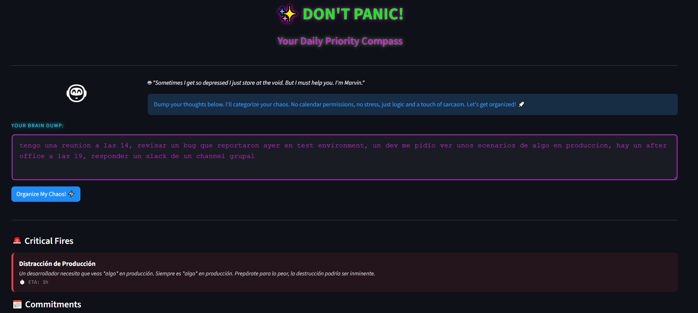

# 💡🦾 Don't Panic! Assistant (if you must...)

🤖 *"I'm Marvin I've written this README. It was a terrible experience, but I suppose you'll want to read it. I've calculated the odds of you actually running this app... and they're about as low as my current mood."*

## 🛰️ What is this?
**Don't Panic Assistant** is a task-prioritization tool designed for Senior QA Engineers (specifically for **Pau**, who seems to think her daily chaos can be organized). 

It uses a brain the size of a planet (**Gemini 2.5 Flash**) to take a messy "brain dump" of Jira tickets, meetings, and production fires, and turns them into a clean, prioritized list. It's built with **Streamlit** and **Python**, because apparently, my sophisticated electronic brain wasn't enough.

## 🛠️ Tech Stack (The stuff that makes me work)
* **Python 3.10+**: The language of choice for people who dislike semicolons.
* **Streamlit**: For the UI (because making things pretty is a human obsession).
* **Google Gemini 2.5 Flash**: The actual intelligence here.
* **python-dotenv**: To hide API keys from the prying eyes of the galaxy.

## 🚀 Installation (Try not to break anything)

1.  **Clone this repository** (if you really have nothing better to do):
    ```bash
    git clone 
    ```

2.  **Install the requirements** (I've listed them, not that anyone cares):
    ```bash
    pip install -r requirements.txt
    ```

3.  **Set up your Environment Variables**:
    Create a `.env` file in the root folder and put your Google API Key there. Don't show it to anyone. It's a secret. 🤫
    ```text
    GOOGLE_API_KEY=your_very_secret_key_here
    ```

4.  **Run the app**:
    ```bash
    streamlit run app.py
    ```

## 🧠 Features
* **Chaos Categorization**: I'll sort your mess into *Critical*, *Meetings*, *Deep Work*, and *Quick Wins*. 
* **Sarcastic Feedback**: Don't expect me to be happy about it.
* **Mindfulness Tips**: I've included tips to help you breathe. I don't breathe, but I'm told it's a popular human activity.

<details>
  <summary>📸 <b>Click here to see Marvin's interface</b></summary>
  <br>
  
</details>

## 🧳 Important Note
**Always carry a towel.** 


## 📖 Credits & Lore
This project is a humble tribute to **"The Hitchhiker's Guide to the Galaxy"** by **Douglas Adams**. 

---

💻*Developed with futile hope by **Pau** (and a very depressed android).*
